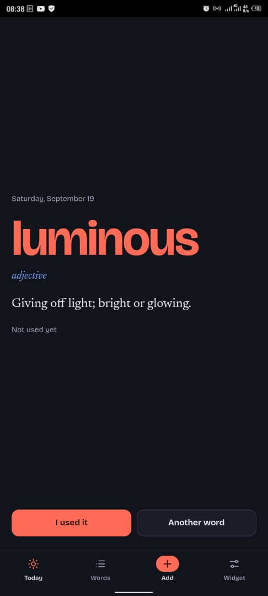
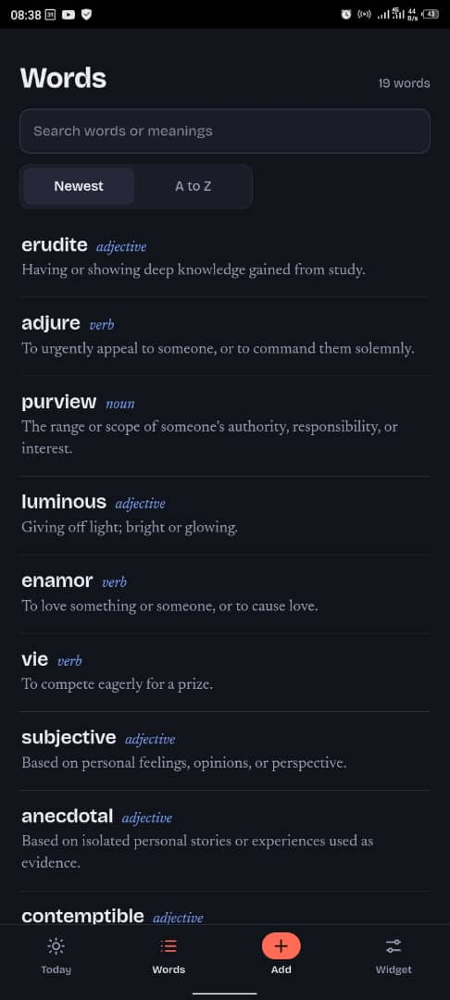
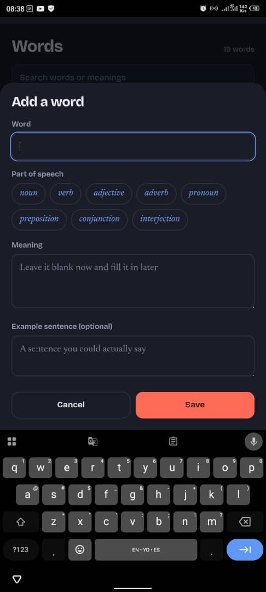
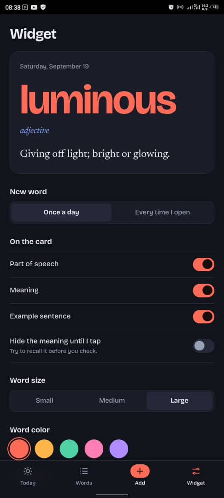
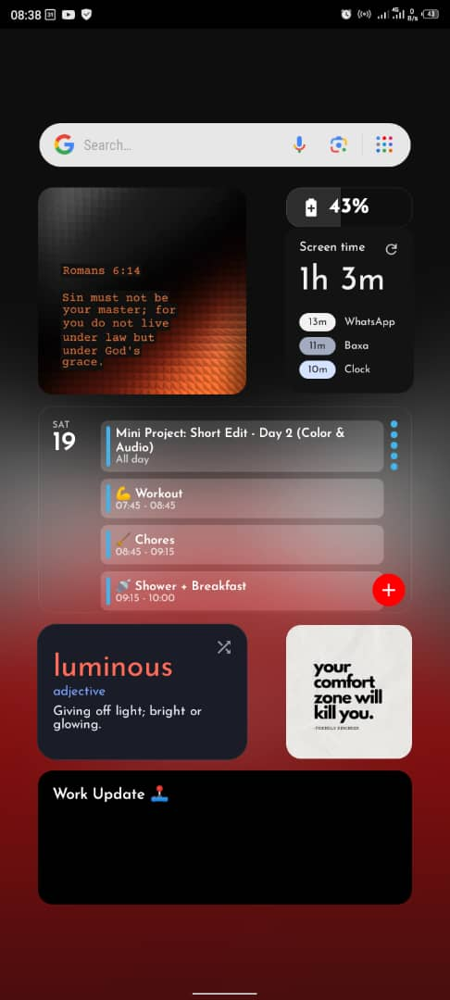

# Wordbook

A personal vocabulary app for Android. Log new words as you come across them, then see a random one on your home screen every day, so you actually use it in conversation.

## Screenshots

<table>
  <tr>
    <td align="center"> Word of the Day</td>
    <td align="center"> Your word list</td>
    <td align="center"> Adding a word</td>
  </tr>
  <tr>
    <td align="center"> Widget options</td>
    <td align="center"> On the home screen</td>
    <td></td>
  </tr>
</table>

## What it does

- **Log words:** save a word with its part of speech, meaning, and an optional example sentence. You can leave the meaning blank and fill it in later.
- **Word of the Day:** the Today tab shows one word from your list. It changes once a day, and every word shows once before any repeats.
- **"I used it" counter:** tap it each time you use the word in real life. The count shows next to each word in your list.
- **Test yourself:** an option hides the meaning until you tap it, so you try to recall it first.
- **Home screen widget:** shows the current word, part of speech, meaning and example. Tap it to open the app, or tap the shuffle icon for another word.
- **Customize:** choose what appears on the card, the word size and color, and dark, light or match-phone theme. The widget follows these settings.
- **Backup:** copy your whole list as text and restore it later, so nothing is lost if you reinstall.

## How it works

The app is a single web page (`app/src/main/assets/index.html`) running inside a small native Android shell. Your words are saved on the device and never leave it.

Whenever you change something, the page sends its data to the native side. The widget reads that data, and if a new day has started it picks the next word by itself. When you open the app again, it picks up whatever word the widget chose, so both always show the same word.

## Install

1. Open the latest release and download `app-debug.apk`.
2. Open the file on your phone and allow installs from that source if Android asks.
3. Touch and hold an empty spot on your home screen, tap Widgets, and drag out Wordbook.

Requires Android 8.0 or newer.

## Moving words from another install

In the old app, go to Widget, then Your data, then Copy backup. In the new one, go to the same place, tap Restore backup, paste, and tap Restore words.

## Building it yourself

Push the project to GitHub and the Build APK workflow (in `.github/workflows`) produces the APK as a downloadable artifact. You can also open the folder in Android Studio and build it there.

## Project layout

- `app/src/main/assets/index.html`: the whole app UI and logic
- `MainActivity.kt`: hosts the web page and connects it to the phone
- `WordStore.kt`: shared storage and the daily word-picking logic
- `WordWidget.kt`: the home screen widget
